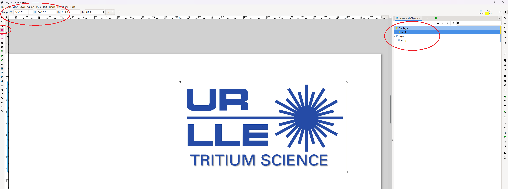
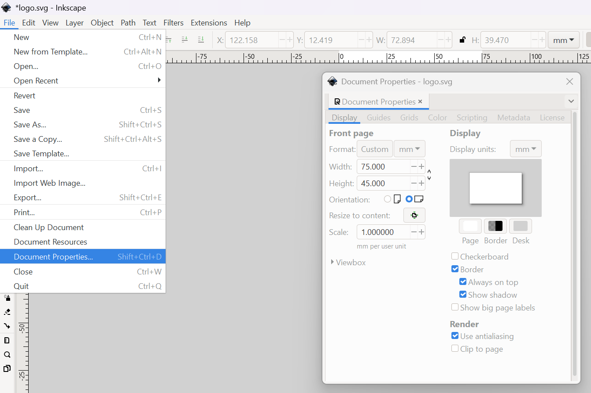
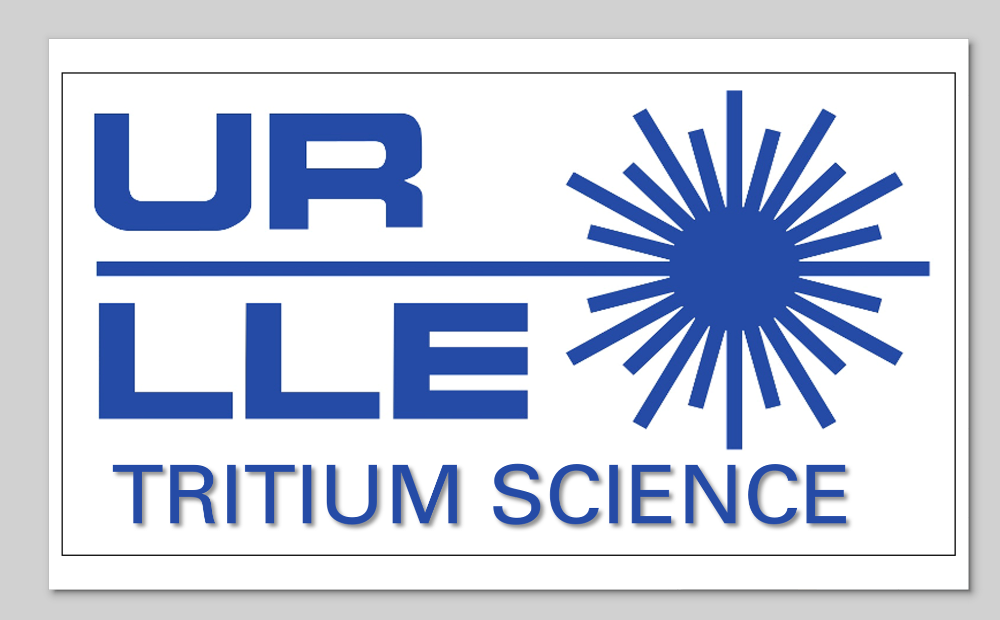
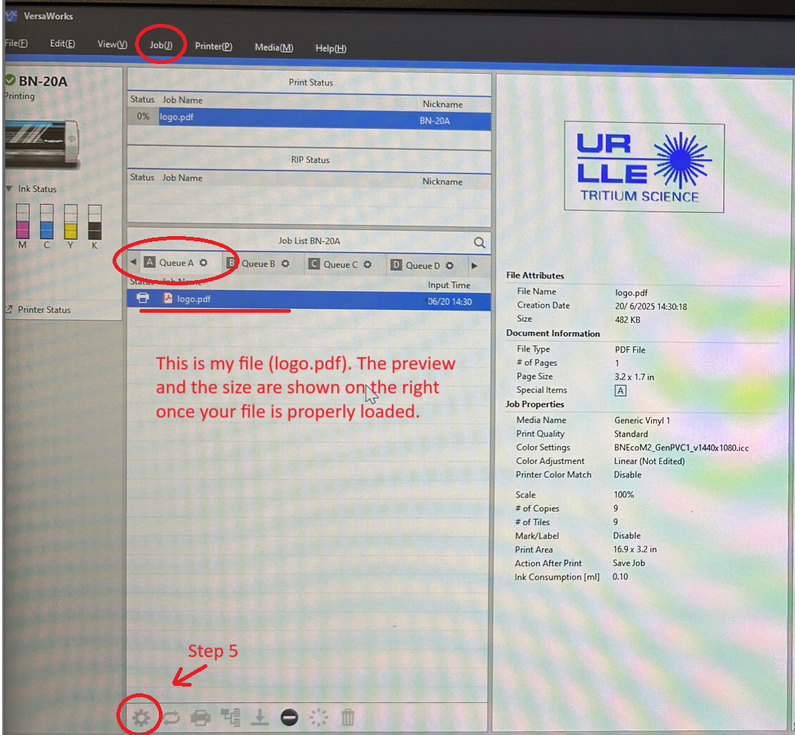

_*These instructions are generally for cutting out a decal/sticker, but can be easily adapted to other jobs*_

# Step 1
Find the image you want to print, and import or copy/paste it into Inkscape. Draw a rectangle or ellipse around your image where you want the vinyl cutter to cut out the shape. Be sure to do this in a second layer that is "on top" of the actual image. Note the size of the boundary for your image (in units of pixels), since we'll need that in the next step. 
See the circled regions in the image below for the critical functions you'll need to use in Inkscape.

# Step 2
If your image looks like mine above, you're in good shape! We need to reduce the amount of whitespace now, so that we don't waste space on the printer. To do that, we need to set the Document Properties -> Display size to the size of our bundary (or slightly larger), as we noted in Step 1. After changing the document size, you'll probably need to move your image over to be centered on the document's whitespace. Once that's done, File -> Export your document as a PDF from Inkscape, and transfer it to the vinylcutter computer.

# Step 3
Open VersaWorks on the vinylcutter's laptop. Check Queue A or Queue B once the program opens, and make sure one of them is open (delete other files if necessary). Drag and drop your file into the Queue. Then open up the Job Assistant from the Job(J) menu on the top of the screen. 

# Step 4
Once the Job Assistant opens, select the box cutter tool from the left. Then click on the [BoB] tool, as shown in the [BoB] screenshot below. Click on the border of your sticker, and it should change to a dotted line. This indicates that after printing, the vinyl cutter will cut out the sticker along this line. Click OK at the bottom of the scren to accept this change.

# Step 5
After clicking OK, there will now be 2 copies of your file in the Queue. Delete the top one, which is the original without the cut-line indicated. Clicker on the Gear icon at the bottom of the screen. 

# Step 6
[BoB] In this menu, you can adjust the size of your object, and the number of copies. Generally, you'll want to print a full row on the printer, inserting a small bit of space between the stickers so you have room to cut them out. [BoB] Adjust the cutting force to 150.

# Step 7
Print it! You'll need the box cutter to slice off your bit of printed stickers once the job finishes. 
